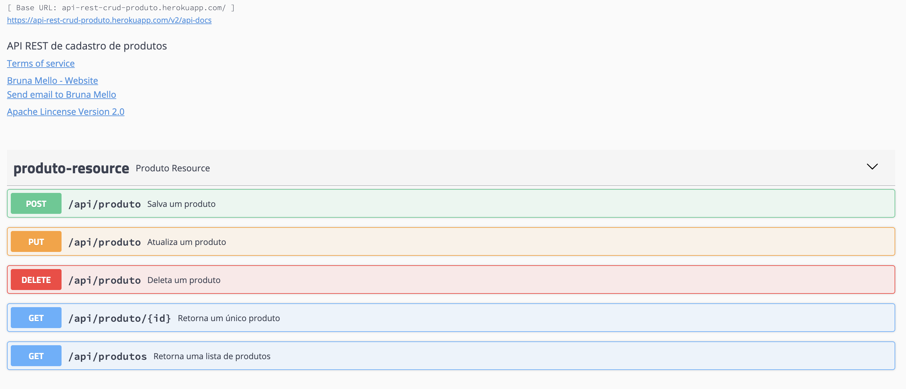

 
# API REST CRUD Products
API REST for Insert, Update, Select and Delete products

For this API was used the folllowing tecnologies:

* [Spring Boot Framework](https://spring.io)
* [Apache Maven](https://maven.apache.org)
* [Swagger UI](https://swagger.io/tools/swagger-ui/)
* [Postgre Database](https://www.postgresql.org/docs/)
* [Heroku for Deployment](https://www.heroku.com)

The 1.0 Version the API can do the requisitions:

* Insert Product
* Update Product
* Select Product
* Select Product by ID
* Delete Product

Heroku Host: https://api-rest-crud-produto.herokuapp.com/swagger-ui.html#/produto-resource

